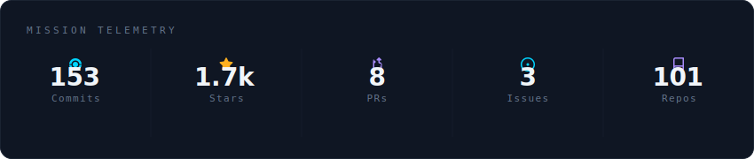

  

 

  

 

  

 

  

 

<strong>More about me</strong>

 

Building practical AI tooling and automation workflows.
Focused on agent systems, developer productivity, and open-source projects.

 

  

