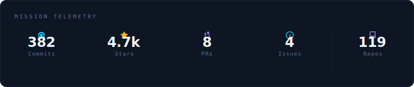

  

 

  

 

## Now Shipping

<table>
  <tr>
    <td width="33%" valign="top">
      <h3>⏱ Tokei 時計</h3>
      

        <a href="https://github.com/cclank/tokei"><strong>cclank/tokei</strong></a>
      

      
macOS menu bar app that tracks usage, cost, and performance across 8 AI coding tools in real-time — all from local logs, zero network traffic.

      

        <a href="https://tokei.lanshuagent.com">Official site</a>
        · Swift
        · AI dev tools
        · privacy-first
      

    </td>
    <td width="33%" valign="top">
      <h3>Lanshu Awesome AI Video Kit</h3>
      

        <a href="https://github.com/cclank/lanshu-awesome-ai-video-kit"><strong>cclank/lanshu-awesome-ai-video-kit</strong></a>
      

      
Enterprise-tested AI video toolkit with 411 prompts, 15 model notes, 7 Claude Skills, and 14 production guides.

      

        <a href="https://lanshu-awesome-ai-video-kit.lank.workers.dev">Live site</a>
        · HTML
        · AI video
        · prompt engineering
      

    </td>
    <td width="33%" valign="top">
      <h3>Cell Architecture Studio</h3>
      

        <a href="https://github.com/cclank/cell-architecture-studio"><strong>cclank/cell-architecture-studio</strong></a>
      

      
Interactive 3D biology gallery built with React, Vite, Three.js, and staged GLB assets. This is the current flagship build.

      

        <a href="https://cell-architecture-studio-inky.vercel.app">Live demo</a>
        · TypeScript
        · Three.js
        · visual verification
      

    </td>
  </tr>
  <tr>
    <td width="33%" valign="top">
      <h3>News Aggregator Skill</h3>
      

        <a href="https://github.com/cclank/news-aggregator-skill"><strong>cclank/news-aggregator-skill</strong></a>
      

      
28-source news workflow that reads full articles, filters signal, and ships source-grounded briefings.

      

        Python
        · automation
        · research workflow
      

    </td>
    <td width="33%" valign="top">
      <h3>X Algorithm Wiki</h3>
      

        <a href="https://github.com/cclank/x-algorithm-wiki"><strong>cclank/x-algorithm-wiki</strong></a>
      

      
Source-anchored architecture wiki for the open-sourced X For You recommendation algorithm, with plain-language guides and technical pages.

      

        27 pages
        · source line anchors
        · Obsidian-ready
      

    </td>
    <td width="33%" valign="top">
    </td>
  </tr>
</table>

## Project Map

### AI Agents & Automation

- **[news-aggregator-skill](https://github.com/cclank/news-aggregator-skill)** - 28-source news firehose that reads full articles and ships substantive briefings.
- **[Hermes-Wiki](https://github.com/cclank/Hermes-Wiki)** - Hermes agent plus an LLM-curated wiki, full source included.
- **[lanshu-idea-incubator](https://github.com/cclank/lanshu-idea-incubator)** - Three-agent debate skill that turns raw ideas into go / no-go decisions.
- **[feishu-multi-agent](https://github.com/cclank/feishu-multi-agent)** - Wizard for multi-bot and multi-agent routing on Feishu.
- **[flowith-image-skill](https://github.com/cclank/flowith-image-skill)** - Automates image generation on Flowith.

### Knowledge Systems & Research

- **[x-algorithm-wiki](https://github.com/cclank/x-algorithm-wiki)** - Source-backed wiki for the X For You recommendation stack.
- **[lansu-wiki-web](https://github.com/cclank/lansu-wiki-web)** - Turn any GitHub wiki repo into a polished, visual reading experience.
- **[formula-decoder-skill](https://github.com/cclank/formula-decoder-skill)** - Decodes math and physics formulas into visual, practical explanations.
- **[hacknews-scraper](https://github.com/cclank/hacknews-scraper)** - Mines Hacker News comments and ships AI-curated digests.
- **[NLM2Img](https://github.com/cclank/NLM2Img)** - Stitch NotebookLM PDF exports into single shareable infographics.

### Creative Media & Visual Tools

- **[lanshu-awesome-ai-video-kit](https://github.com/cclank/lanshu-awesome-ai-video-kit)** - AI video project kit with 411 prompts, 15 model notes, 7 Claude Skills, and 14 production guides.
- **[cell-architecture-studio](https://github.com/cclank/cell-architecture-studio)** - Interactive 3D cell gallery with GLB rendering, comparison mode, and an AI Tutor panel.
- **[lanshu-waytovideo](https://github.com/cclank/lanshu-waytovideo)** - Drives Jianying Cloud plus Seedance 2.0 to produce T2V / I2V / V2V runs on autopilot.
- **[recipe-generator](https://github.com/cclank/recipe-generator)** - Michelin-grade recipes paired with high-fidelity image prompts.
- **[qwenimg](https://github.com/cclank/qwenimg)** - Tongyi Wanxiang playground for text-to-image and image-to-video on FastAPI plus React.
- **[lumina-style-studio](https://github.com/cclank/lumina-style-studio)** - Live website palette studio: tweak colors and watch the theme follow.
- **[xhs-cover-skill](https://github.com/cclank/xhs-cover-skill)** - One-shot Xiaohongshu cover and infographic prompt generator.
- **[SpectraTales](https://github.com/cclank/SpectraTales)** - Gemini-powered storytelling app, scaffolded from AI Studio.
- **[timeslice-fusion](https://github.com/cclank/timeslice-fusion)** - Fuse 360 degree panoramic footage with selfies into cinematic shorts.

### Developer Tools & Infrastructure

- **[tokei](https://github.com/cclank/tokei)** - macOS menu bar app tracking usage, cost, and performance across 8 AI coding tools — local logs only, zero network traffic.
- **[modelbox](https://github.com/cclank/modelbox)** - OpenAI-protocol proxy for context debugging: mock, passthrough, and capture payloads.
- **[model-ui-arena](https://github.com/cclank/model-ui-arena)** - Standardized arena for comparing LLM UI outputs side by side under shared constraints.
- **[localsign](https://github.com/cclank/localsign)** - Local-first signature tool for images and PDFs; everything runs in the browser.
- **[lanshu-comfy-lib](https://github.com/cclank/lanshu-comfy-lib)** - Lanshu's ComfyUI toolbox: curated nodes, workflows, and recipes.
- **[gemini-downloader-extension](https://github.com/cclank/gemini-downloader-extension)** - Bulk-download Gemini chat images with watermark removal.
- **[lanshu-tiktok-snatcher](https://github.com/cclank/lanshu-tiktok-snatcher)** - Fully automated TikTok viral-video harvester.
