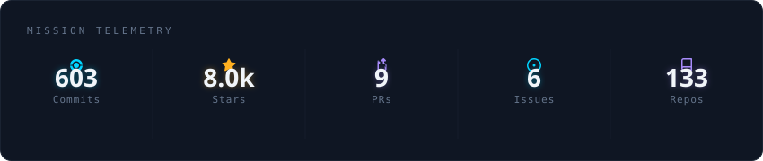

  

 

  

 

## Now Shipping

<table>
  <tr>
    <td width="33%" valign="top">
      <h3>AI Presenter Video</h3>
      

        <a href="https://github.com/cclank/lanshu-create-ai-presenter-video"><strong>cclank/lanshu-create-ai-presenter-video</strong></a>
      

      
Provider-neutral Codex skill for producing QA-checked presenter videos from a script and an authorized presenter image.

      

        Python
        · FFmpeg
        · digital human
      

    </td>
    <td width="33%" valign="top">
      <h3>DSH Plugin Hub</h3>
      

        <a href="https://github.com/cclank/dsh-plugin-hub"><strong>cclank/dsh-plugin-hub</strong></a>
      

      
Searchable DeepSeek Harness plugin registry with commit-pinned install evidence, plugin passports, and transparent risk signals.

      

        <a href="https://dsh.lanshuagent.com/">Live site</a>
        · Cloudflare Workers
        · TypeScript
      

    </td>
    <td width="33%" valign="top">
      <h3>HTML2Video</h3>
      

        <a href="https://github.com/cclank/lanshu-html2video-skill"><strong>cclank/lanshu-html2video-skill</strong></a>
      

      
Codex skill that turns web articles into reviewable 1080p videos through a deterministic Remotion pipeline.

      

        TypeScript
        · Remotion
        · article-to-video
      

    </td>
  </tr>
  <tr>
    <td width="33%" valign="top">
      <h3>Tokei 知度</h3>
      

        <a href="https://github.com/cclank/tokei"><strong>cclank/tokei</strong></a>
      

      
macOS menu bar app for tracking usage, cost, quota, and performance across 9 AI coding tools from local logs.

      

        <a href="https://tokei.lanshuagent.com">Official site</a>
        · macOS
        · local logs
      

    </td>
    <td width="33%" valign="top">
      <h3>Animated Architecture Diagram</h3>
      

        <a href="https://github.com/cclank/lanshu-animated-architecture-diagram"><strong>cclank/lanshu-animated-architecture-diagram</strong></a>
      

      
Codex skill and local renderer for hand-drawn architecture diagrams with editable Excalidraw, PNG previews, and animated GIFs.

      

        Python
        · Excalidraw
        · animated GIF
      

    </td>
    <td width="33%" valign="top">
      <h3>Cell Architecture Studio</h3>
      

        <a href="https://github.com/cclank/cell-architecture-studio"><strong>cclank/cell-architecture-studio</strong></a>
      

      
Interactive 3D cell architecture gallery with GLB models, comparison views, and an AI tutor for visual biology learning.

      

        <a href="https://cell-architecture-studio.lanshuagent.com/">Official site</a>
        · Three.js
        · GLB
      

    </td>
  </tr>
</table>

## Project Map

### AI Agents & Automation

- **[news-aggregator-skill](https://github.com/cclank/news-aggregator-skill)** - 28-source news firehose that reads full articles and ships substantive briefings.
- **[Hermes-Wiki](https://github.com/cclank/Hermes-Wiki)** - Hermes agent source plus an LLM-curated wiki for reading the architecture.
- **[lanshu-wiki-skill](https://github.com/cclank/lanshu-wiki-skill)** - Claude Code skill for turning codebases into Karpathy-style LLM Wikis.
- **[lanshu-idea-incubator](https://github.com/cclank/lanshu-idea-incubator)** - Multi-agent debate workflow that turns raw ideas into go / no-go decisions.
- **[feishu-multi-agent](https://github.com/cclank/feishu-multi-agent)** - Wizard for multi-bot and multi-agent routing on Feishu.
- **[flowith-image-skill](https://github.com/cclank/flowith-image-skill)** - Automates image generation on Flowith.

### Memory & Knowledge Systems

- **[everos-memory-archive](https://github.com/cclank/everos-memory-archive)** - Local backup and portable archive for Codex and Claude Code memories.
- **[x-algorithm-wiki](https://github.com/cclank/x-algorithm-wiki)** - Source-backed wiki for the X For You recommendation stack.
- **[lanshu-wiki-web](https://github.com/cclank/lanshu-wiki-web)** - Turn any GitHub wiki repo into a polished, visual reading experience.
- **[formula-decoder-skill](https://github.com/cclank/formula-decoder-skill)** - Decodes math and physics formulas into visual, practical explanations.
- **[NLM2Img](https://github.com/cclank/NLM2Img)** - Stitch NotebookLM PDF exports into single shareable infographics.
- **[hacknews-scraper](https://github.com/cclank/hacknews-scraper)** - Mines Hacker News comments and ships AI-curated digests.

### Creative Media & Visual Tools

- **[lanshu-create-ai-presenter-video](https://github.com/cclank/lanshu-create-ai-presenter-video)** - Provider-neutral Codex skill for presenter video production, lip sync, captions, editing, and QA.
- **[lanshu-html2video-skill](https://github.com/cclank/lanshu-html2video-skill)** - Turns web articles into reviewable 1080p videos with structured storyboards and Remotion.
- **[lanshu-animated-architecture-diagram](https://github.com/cclank/lanshu-animated-architecture-diagram)** - Premium animated architecture diagrams with Excalidraw, PNG, and GIF outputs.
- **[cell-architecture-studio](https://github.com/cclank/cell-architecture-studio)** - Interactive 3D cell gallery with GLB rendering, comparison mode, and an AI Tutor panel.
- **[lanshu-awesome-ai-video-kit](https://github.com/cclank/lanshu-awesome-ai-video-kit)** - AI video project kit with 411 prompts, 15 model notes, 7 Claude Skills, and production guides.
- **[lanshu-waytovideo](https://github.com/cclank/lanshu-waytovideo)** - Drives Jianying Cloud plus Seedance 2.0 to produce T2V / I2V / V2V runs on autopilot.

### Developer Tools & Ecosystems

- **[dsh-plugin-hub](https://github.com/cclank/dsh-plugin-hub)** - DeepSeek Harness plugin directory with commit-pinned install evidence, version diffs, and risk signals.
- **[tokei](https://github.com/cclank/tokei)** - macOS menu bar app tracking usage, cost, quota, and performance across 9 AI coding tools.
- **[modelbox](https://github.com/cclank/modelbox)** - OpenAI-protocol proxy for context debugging: mock, passthrough, and capture payloads.
- **[model-ui-arena](https://github.com/cclank/model-ui-arena)** - Standardized arena for comparing LLM UI outputs side by side under shared constraints.
- **[localsign](https://github.com/cclank/localsign)** - Local-first signature tool for images and PDFs; everything runs in the browser.
